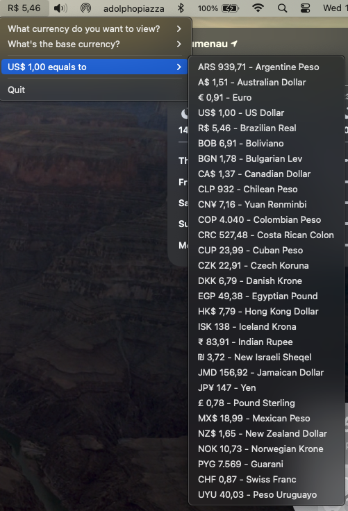

# EasyCurrency

EasyCurrency lives in the menu bar of your macOS system:

 

You choose your view currency, base currency and voilá:

 

Keep track directly at the menu bar:

 

Or check the list of currencies in the app:

 
